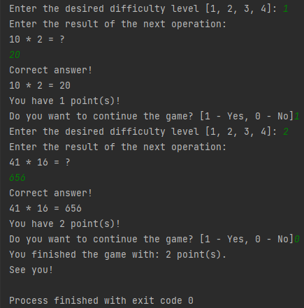

<!-- Author: Humberto Bianchini -->

# Math Game

## Description

Simple math game where when it starts it asks the user to choose the level of difficulty of the game and after that generates and presents, in a random way, a calculation so that may we inform the result. We will limit the operations to add, sub and multiply. If the user gets the right answer, it'll add 1 point to his score. Hit or miss, it may or may not continue the game.

## Usage

<!-- Author: Humberto Bianchini -->
